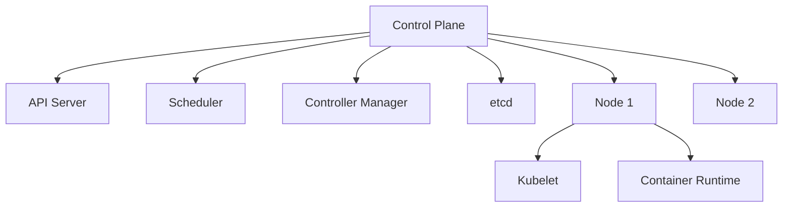

# Introduction to Kubernetes

Kubernetes (K8s) is an open-source platform for automating the deployment, scaling, and management of containerized applications. It simplifies tasks like load balancing, scaling, and self-healing for containerized workloads.

## What is Kubernetes?
- **Containers**: Lightweight, portable units that package applications and their dependencies.
- **Orchestration**: Managing multiple containers across servers, ensuring high availability and scalability.
- **Kubernetes**: A system to orchestrate containers, handling tasks like scheduling, networking, and storage.

## Why Use Kubernetes?
- Automates deployment and scaling.
- Ensures high availability with self-healing.
- Simplifies service discovery and load balancing.

## Kubernetes Architecture
Kubernetes clusters consist of:
- **Control Plane**: Manages the cluster (e.g., API server, scheduler, controller manager).
- **Nodes**: Worker machines that run containers (each has a kubelet and container runtime).

## Next Steps
- Learn how to set up a Kubernetes cluster in [Installation Guide](02-installation.md).
- Explore core concepts in [Core Concepts](03-core-concepts.md).